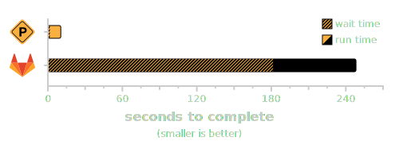

demo
====

comparing pre-commit.ci against a bunch of other ci providers

### results

_last tabulated on 2020-12-15_

runs are averaged over 5 pull requests.  timing starts on PR creation.

note: gitlab took much longer to complete so it is on a separate graph:

the raw data is available [here](./data/2020-12-15_noop.tsv)
